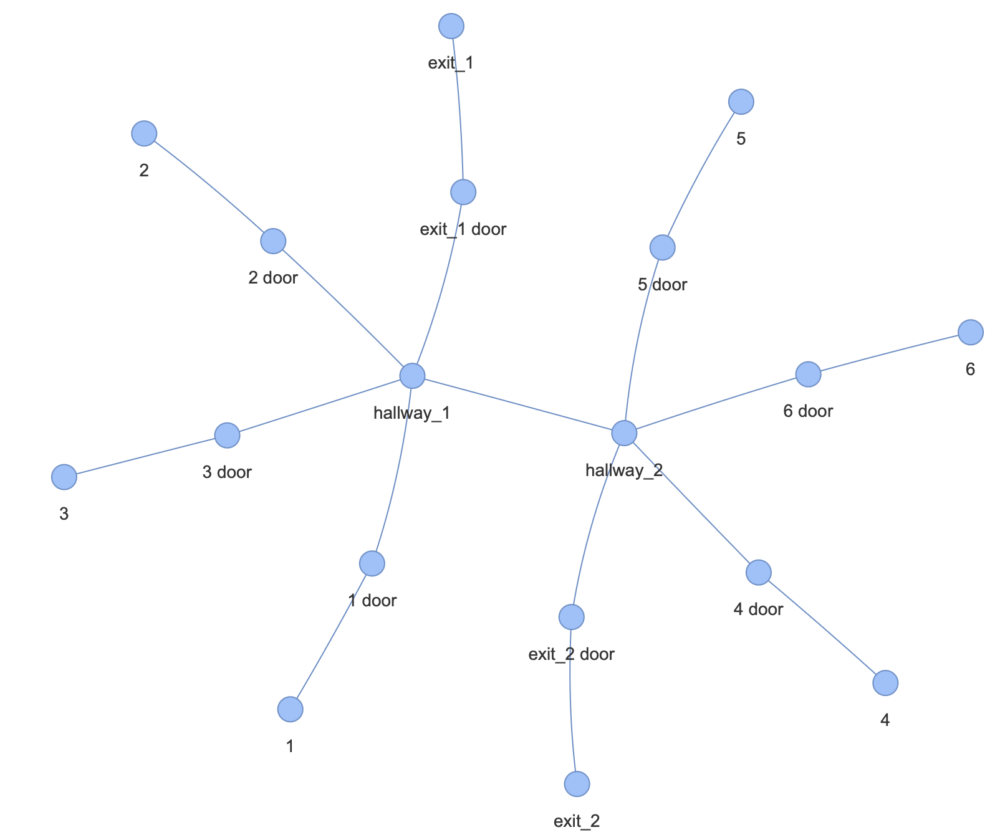

# buildLang (v0.0)
A compact textual representation of buildings for path planning.

Does not encode contours/building geometries.

## Dependencies
- Node.js 22.10.1 or higher
- (For visualization) sqlite3, networkx, pyvis

## Usage
1. Edit the filepath in ```test.ts```.
2. In a terminal, run ```tsc test.ts --downlevelIteration```.
3. In a terminal, run ```node test.js```.
4. Copy SQL output from the terminal and set as the value of ```populate_buildings``` in [test-buildLang.ipynb](https://github.com/polaris-maps/buildLang/tree/main/Visualizer-Python/test-buildLang.ipynb)
5. Run the Jupyter notebook.
6. View output in ```test-buildLang.html``` via a browser.

## Example program
```
building small {
    floor 0 {
        hallway_1 {
            1, 2;
            3;
            |hallway_2;
            exit_1;
        },
        hallway_2 {
            4;
            5, 6;
            |hallway_1;
            exit_2;
        }
    }
}
```
## Example output
### SQL
```
INSERT INTO Buildings (name) VALUES ("small");
INSERT INTO Nodes (name, node_type) VALUES ("hallway_1", "room");
INSERT INTO Nodes (name, node_type) VALUES ("1", "room");
INSERT INTO Nodes (name, node_type) VALUES ("1 door", "door");
INSERT INTO Edges (source_node, target_node, source_side, source_rank) VALUES (2, 3, 0, 0);
INSERT INTO Edges (source_node, target_node, source_side, source_rank) VALUES (1, 3, 1, 1);
INSERT INTO Nodes (name, node_type) VALUES ("2", "room");
INSERT INTO Nodes (name, node_type) VALUES ("2 door", "door");
INSERT INTO Edges (source_node, target_node, source_side, source_rank) VALUES (4, 5, 0, 0);
INSERT INTO Edges (source_node, target_node, source_side, source_rank) VALUES (1, 5, 1, 2);
INSERT INTO Nodes (name, node_type) VALUES ("3", "room");
INSERT INTO Nodes (name, node_type) VALUES ("3 door", "door");
INSERT INTO Edges (source_node, target_node, source_side, source_rank) VALUES (6, 7, 0, 0);
INSERT INTO Edges (source_node, target_node, source_side, source_rank) VALUES (1, 7, 2, 1);
INSERT INTO Nodes (name, node_type) VALUES ("hallway_2", "room");
INSERT INTO Edges (source_node, target_node, source_side, source_rank) VALUES (1, 8, 3, 1);
INSERT INTO Nodes (name, node_type) VALUES ("exit_1", "room");
INSERT INTO Nodes (name, node_type) VALUES ("exit_1 door", "door");
INSERT INTO Edges (source_node, target_node, source_side, source_rank) VALUES (9, 10, 0, 0);
INSERT INTO Edges (source_node, target_node, source_side, source_rank) VALUES (1, 10, 4, 1);
INSERT INTO Nodes (name, node_type) VALUES ("hallway_2", "room");
INSERT INTO Nodes (name, node_type) VALUES ("4", "room");
INSERT INTO Nodes (name, node_type) VALUES ("4 door", "door");
INSERT INTO Edges (source_node, target_node, source_side, source_rank) VALUES (12, 13, 0, 0);
INSERT INTO Edges (source_node, target_node, source_side, source_rank) VALUES (11, 13, 1, 1);
INSERT INTO Nodes (name, node_type) VALUES ("5", "room");
INSERT INTO Nodes (name, node_type) VALUES ("5 door", "door");
INSERT INTO Edges (source_node, target_node, source_side, source_rank) VALUES (14, 15, 0, 0);
INSERT INTO Edges (source_node, target_node, source_side, source_rank) VALUES (11, 15, 2, 1);
INSERT INTO Nodes (name, node_type) VALUES ("6", "room");
INSERT INTO Nodes (name, node_type) VALUES ("6 door", "door");
INSERT INTO Edges (source_node, target_node, source_side, source_rank) VALUES (16, 17, 0, 0);
INSERT INTO Edges (source_node, target_node, source_side, source_rank) VALUES (11, 17, 2, 2);
INSERT INTO Nodes (name, node_type) VALUES ("hallway_1", "room");
INSERT INTO Edges (source_node, target_node, source_side, source_rank) VALUES (11, 18, 3, 1);
INSERT INTO Nodes (name, node_type) VALUES ("exit_2", "room");
INSERT INTO Nodes (name, node_type) VALUES ("exit_2 door", "door");
INSERT INTO Edges (source_node, target_node, source_side, source_rank) VALUES (19, 20, 0, 0);
INSERT INTO Edges (source_node, target_node, source_side, source_rank) VALUES (11, 20, 4, 1);
```
### Image
